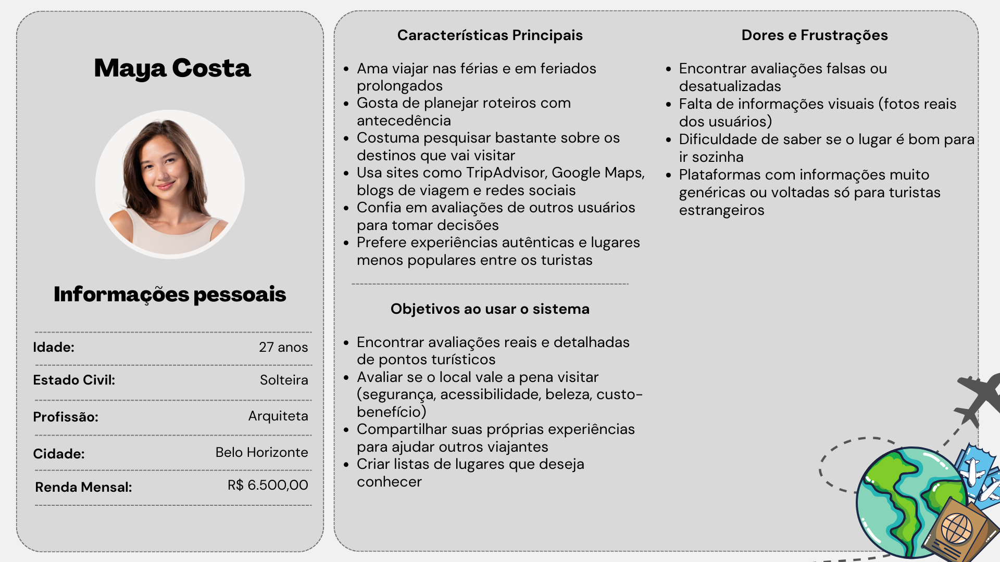

# 4. PROJETO DO DESIGN DE INTERAÇÃO

## 4.1 Personas

## 4.2 Mapa de Empatia

## 4.3 Protótipos das Interfaces
### 4.3.1 Tela de login

### 4.3.2 Tela de cadastro

### 4.3.3 Tela de recuperação de senha

### 4.3.4 Tela de home

### 4.3.4 Tela de lugar (detalhes de um post)

### 4.3.4 Tela de cadastro de lugar

