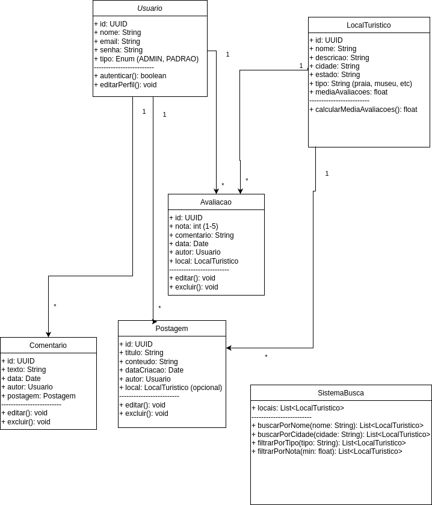

# 3. DOCUMENTO DE ESPECIFICAÇÃO DE REQUISITOS DE SOFTWARE

Constarão a seguir os detalhamentos dos requisitos do sistema.

## 3.1 Objetivos deste documento
Descrever e especificar as necessidades dos Usuários que devem ser
atendidas pelo projeto Tourist Guide, um sistema para compartilhamento e descoberta de locais turísticos.

## 3.2 Escopo do produto

### 3.2.1 Nome do produto e seus componentes principais
O produto será denominado Tourist Guide. Ele terá os seguintes componentes principais:
- Sistema de gerenciamento de usuários
- Sistema de gerenciamento de locais turísticos
- Sistema de avaliações e comentários
- Sistema de busca e filtros
- Interface web responsiva

### 3.2.2 Missão do produto
Facilitar a descoberta e compartilhamento de locais turísticos, permitindo que usuários encontrem, avaliem e compartilhem experiências sobre destinos turísticos.

### 3.2.3 Limites do produto
O Tourist Guide não fornece:
- Sistema de reservas ou agendamentos
- Integração com sistemas de pagamento
- Recomendações personalizadas baseadas em algoritmos complexos
- Sistema de chat ou mensagens diretas entre usuários

### 3.2.4 Benefícios do produto

| # | Benefício | Valor para o Cliente |
|--------------------|------------------------------------|----------------------------------------|
|1	| Descoberta de novos destinos turísticos |	Essencial |
|2 | Compartilhamento de experiências | Essencial | 
|3 | Avaliações e recomendações da comunidade | Essencial | 
|4	| Busca e filtros eficientes	| Essencial | 
|5 | Interface intuitiva e responsiva | Recomendável |

## 3.3 Descrição geral do produto

### 3.3.1 Requisitos Funcionais

| Código | Requisito Funcional (Funcionalidade) | Descrição |
|--------------------|------------------------------------|----------------------------------------|
| RF1 | Gerenciar Usuários |	Processamento de Inclusão, Alteração, Exclusão e Consulta de Usuários |
| RF2 |	Gerenciar Postagens	| Processamento de Inclusão, Alteração, Exclusão e Consulta de postagens |
| RF3 | Gerenciar Locais Turísticos |	Permitir o cadastro, edição, exclusão e consulta de locais turísticos |
| RF4 |	Avaliar Locais	| Permitir que usuários registrem avaliações e notas sobre locais turísticos |
| RF5 | 	Buscar Locais Turísticos |	Sistema de busca textual com filtro por cidade, nome, tipo de atração etc |
| RF6 |	Filtrar Locais por Critérios	| Filtro por tipo (praia, museu, parque...), nota média, distância, etc |
| RF7 | Autenticar Usuário |	Sistema de login e logout para controle de acesso (Admin vs Usuário) |
| RF8 |	Gerenciar Comentários	| Processamento de Inclusão, Alteração, Exclusão e Consulta de comentários |
| RF9 | Compartilhar Local | Permitir que usuários compartilhem locais turísticos em redes sociais |
| RF10 | Criar Roteiros | Permitir que usuários criem e gerenciem roteiros de viagem com múltiplos locais |
| RF11 | Favoritar Locais | Permitir que usuários marquem locais como favoritos para acesso rápido |
| RF12 | Notificações | Sistema de notificações para atualizações de locais favoritos ou roteiros |
| RF13 | Galeria de Fotos | Permitir que usuários façam upload e gerenciem fotos dos locais visitados |
| RF14 | Relatórios de Popularidade | Gerar relatórios sobre os locais mais populares e bem avaliados |
| RF15 | Moderação de Conteúdo | Sistema para administradores moderarem conteúdo inadequado |
| RF16 | Contatar por whatsapp | Entra em contato com a empresa através do whatsapp |

### 3.3.2 Requisitos Não Funcionais

| Código | Requisito Não Funcional (Restrição) |
|--------------------|------------------------------------|
| RNF1 | Desempenho O sistema deve suportar até 100 usuários simultâneos sem degradação significativa de desempenho. |
| RNF2 | Compatibilidade O software deve ser compatível com os sistemas operacionais Windows, macOS e Linux |
| RNF3 | Segurança	O sistema deve possuir uma camada de firewall que restrinja o acesso de localidades não cadastradas no software. |
| RNF4 | Usabilidade: A interface do usuário deve ser intuitiva, responsível e acessível, com suporte para múltiplos idiomas. |

### 3.3.3 Usuários 

| Ator | Descrição |
|--------------------|------------------------------------|
| Admin |	Usuário que acesso geral ao sistema ele poderá editar qualquer postagem e alterar informações de outros usuários. |
| Usuário padrão |	Usuário que possui permissão de gerenciar apenas suas postagens e interagir com postagens de terceiros. |

## 3.4 Modelagem do Sistema

### 3.4.1 Diagrama de Casos de Uso

#### Figura 1: Diagrama de Casos de Uso do Sistema.

 
### 3.4.2 Descrições de Casos de Uso

#### Gerenciar Locais Turísticos (CSU01)

Sumário: O usuário realiza a gestão (inclusão, remoção, alteração e consulta) dos dados sobre locais turísticos.

Ator Primário: Usuário/Admin

Pré-condições: O usuário deve estar autenticado no sistema.

Fluxo Principal:
1. O usuário acessa a seção de locais turísticos
2. O sistema apresenta as operações disponíveis: adicionar, editar, remover ou consultar locais
3. O usuário seleciona a operação desejada
4. O sistema executa a operação solicitada
5. O sistema atualiza a lista de locais

Fluxo Alternativo (3): Adicionar Local
a. O usuário preenche o formulário com dados do local (nome, descrição, endereço, tipo, etc.)
b. O sistema valida os dados
c. O sistema salva o novo local
d. O sistema confirma o cadastro

#### Avaliar Local (CSU02)

Sumário: O usuário avalia um local turístico com nota e comentário.

Ator Primário: Usuário

Pré-condições: O usuário deve estar autenticado.

Fluxo Principal:
1. O usuário acessa a página do local turístico
2. O usuário seleciona a opção de avaliar
3. O usuário fornece uma nota (1-5) e um comentário
4. O sistema salva a avaliação
5. O sistema atualiza a média de avaliações do local

### 3.4.3 Diagrama de Classes 

#### Figura 2: Diagrama de Classes do Tourist Guide

### 3.4.4 Descrições das Classes 

| # | Nome | Descrição |
|--------------------|------------------------------------|----------------------------------------|
| 1	| Usuário |	Representa os usuários do sistema, com seus dados e permissões |
| 2	| Local |	Representa um local turístico com suas características e avaliações |
| 3 | Avaliacao |	Representa as avaliações feitas pelos usuários nos locais |
| 4 | Comentario |	Representa os comentários feitos pelos usuários |
| 5	| Postagem |	Representa as postagens sobre locais turísticos |
